# 🔐 Awesome Customer Identity & Access Management (CIAM)

### *The Ultimate Curated List of SaaS Identity Platforms & Open-Source Auth GitHub Projects*

**Focused on Customer Authentication 🛡️, Multi-Tenancy B2B 🏢, Single Sign-On (SSO) 🔑, Passkeys 🔏 & User Governance 👤**

*Last updated: September 2026* 📅

---

## 📌 Introduction & Overview

Welcome to the definitive ecosystem directory for **Customer Identity & Access Management (CIAM)**, **User Authentication**, and **Enterprise SSO**. 

Whether you are building a B2B multi-tenant SaaS application, a consumer mobile app, or a secure enterprise portal, choosing the right identity architecture is critical. This repository tracks both category-leading **SaaS Platforms** (Auth0, Okta, Descope, WorkOS, Stytch) and production-proven **Open-Source Self-Hosted Projects** (Supabase, Keycloak, Authelia, Zitadel, Logto, SuperTokens, Ory).

---

## 📑 Table of Contents

- [☁️ SaaS / Hosted Identity Platforms](#️-saas--hosted-identity-platforms)
- [🔓 Open-Source GitHub Projects](#-open-source-github-projects)
- [🤝 How to Contribute](#-how-to-contribute)
- [💖 Support & Sponsorship](#-support--sponsorship)
- [📈 Star History](#-star-history)
- [⚠️ Disclaimer](#️-disclaimer)

---

## ☁️ SaaS / Hosted Identity Platforms

The global Customer Identity and Access Management (CIAM) market is estimated at **$13 billion to $16 billion**, growing at ~15% CAGR. The sector is **moderately fragmented** with competing enterprise platforms (Okta/Auth0, Ping Identity, AWS) and developer-focused identity startups; it is not a winner-take-all market. 📈

| Platform 🚀 | Starting Price (Paid Tier) 💵 | Free Tier Limit 🎁 | Company Size / Valuation 📊 | Description 📝 |
| :--- | :--- | :--- | :--- | :--- |
| **[Amazon Cognito](https://aws.amazon.com/cognito/)** ☁️ | $0.0055 / MAU (Lite Tier above free allowance) | Free up to 10,000 MAUs per month | ~$3.1 Trillion (Amazon Market Cap) | AWS-native CIAM service. Provides user pools for authentication and identity pools for AWS credential federation, integrated with the AWS ecosystem. |
| **[Okta Customer Identity](https://www.okta.com/)** 🏢 | $240 / month (or custom enterprise contracts) | 30-day free trial with unlimited test users | ~$35 Billion (Market Cap, FY26 Revenue ~$2.9B) | Enterprise CIAM solution within Okta's broader identity platform. Provides authentication, MFA, and user management for customer-facing applications. |
| **[Auth0](https://auth0.com/)** 🔐 | $35 / month (B2C Essentials) | Free up to 25,000 MAUs per month (1 tenant limit) | Acquired by Okta for $6.5 Billion (Subsidiary of Okta) | The dominant CIAM platform. Provides authentication, authorization, social login, MFA, and extensibility via Actions/Rules. Enterprise-grade with extensive SDKs and integrations. |
| **[WorkOS](https://workos.com/)** 💼 | $125 / month per SSO/SCIM connection | Free up to 1,000,000 MAUs for user management (AuthKit) | ~$2.0 Billion Valuation ($100M Series C, ~$30M ARR) | Enterprise-ready CIAM focused on SSO and directory sync. Provides APIs for adding enterprise SSO (SAML, OIDC) and SCIM provisioning to existing applications. |
| **[PingOne for Customers](https://www.pingidentity.com/)** 🛡️ | ~$20,000 / year (Essential Tier floor) | 30-day free trial (No permanent free plan) | Acquired by Thoma Bravo for $2.8 Billion | Enterprise CIAM solution within Ping Identity's platform. Provides authentication, authorization, and identity orchestration for customer applications. |
| **[Stytch](https://stytch.com/)** 🔑 | $0.05 / additional MAU | Free up to 10,000 MAUs per month | ~$1.0 Billion Valuation (Series B Unicorn, ~$12M ARR) | Developer-first authentication platform. Provides passwordless login, MFA, and session management with strong API design. |
| **[Descope](https://www.descope.com/)** 🎨 | $249 / month (Pro plan up to 10k MAUs) | Free up to 7,500 MAUs per month | $88 Million Raised (Seed round funding) | No-code CIAM platform with visual workflow builder. Provides passwordless authentication, MFA, and user management with drag-and-drop orchestration. |
| **[FusionAuth](https://fusionauth.io/)** 🚀 | $162 / month (Starter cloud hosting tier) | Free Community Edition (Unlimited MAU self-hosted) | $65 Million Raised (~$10M ARR) | Developer-focused CIAM platform. Offers a free Community Edition for self-hosting with unlimited MAU. Provides authentication, SSO, social login, and MFA with extensive APIs. |
| **[LoginRadius](https://www.loginradius.com/)** 🌐 | Custom quote / Sales-led enterprise plans | Free Developer Plan up to 10,000 MAUs | Acquired by Volaris Group (~$22.6M ARR, $21.8M Raised) | CIAM platform with social login, MFA, and user management. Provides identity APIs and compliance features. |
| **[SuperTokens](https://supertokens.com/)** ⚡ | $0.02 / additional MAU (Managed Cloud) | Free up to 5,000 MAUs (Cloud) / Unlimited MAU (Self-hosted core) | Early-Stage Venture Backed (~$5M ARR) | Open-core authentication platform. Provides embedded login UI and session management with Apache 2.0 core. |

---

## 🔓 Open-Source GitHub Projects

This section features active, production-proven open-source identity projects for self-hosting, custom authentication flows, and total data sovereignty. Projects are sorted by GitHub Star Count (descending) ⭐️.

1. **[Supabase Auth](https://github.com/supabase/supabase)**  🌟  
   **The open-source Firebase alternative with built-in JWT authentication & user management.** **Apache-2.0 licensed**. Provides row-level security (RLS) integration with PostgreSQL, social logins (OAuth), magic links, SMS auth, and SAML SSO. **Best for**: Full-stack applications built on PostgreSQL. ⚡

2. **[Keycloak](https://github.com/keycloak/keycloak)**  🌟  
   **The most mature and widely adopted open-source identity platform.** **Apache-2.0 licensed**, developed by Red Hat and a **CNCF project**. Provides comprehensive SSO, social login, MFA, LDAP/Active Directory federation, and user federation. Admin console for centralized management and clustering for high availability. **Best for**: Enterprise-grade CIAM with broad protocol coverage (OIDC, OAuth 2.0, SAML 2.0). 🏛️

3. **[Authelia](https://github.com/authelia/authelia)**  🌟  
   **Lightweight authentication and authorization server for protecting internal tools & reverse proxies.** **Apache-2.0 licensed**, deploys as a single container. Adds TOTP, WebAuthn/passkeys, and Duo push MFA in front of applications. **Best for**: Protecting self-hosted services and infrastructure. 🛡️

4. **[Authentik](https://github.com/goauthentik/authentik)**  🌟  
   **User-friendly open-source identity provider.** Focuses on usability while offering powerful capabilities. Supports SAML, OAuth2, LDAP, RADIUS, and application proxy for legacy apps. Docker-native deployment. **Best for**: Modern teams wanting an intuitive single-product IdP. 🎯

5. **[SuperTokens](https://github.com/supertokens/supertokens-core)**  🌟  
   **Open-source authentication with embedded login UI and session management.** **Apache-2.0 licensed** core with unlimited MAU. Stores user data and password hashes in your own PostgreSQL/MySQL. Provides email/password, social login, passwordless, and rotating session refresh tokens. **Best for**: Product teams wanting to own their auth code without managing full IAM servers. 🛠️

6. **[Zitadel](https://github.com/zitadel/zitadel)**  🌟  
   **Modern CIAM built for B2B SaaS and multi-tenancy.** **AGPL-3.0 licensed**. Native multi-tenant architecture with organizations and projects as first-class concepts. Event-sourced for full audit trails of permission changes. Supports OAuth 2.0, OIDC, SAML 2.0, SCIM, FIDO2, and passkeys. **Best for**: B2B SaaS requiring native multi-tenancy. 🏢

7. **[Logto](https://github.com/logto-io/logto)**  🌟  
   **The open-source Auth0 alternative for modern apps & B2B SaaS.** **MPL-2.0 licensed**. Features an out-of-the-box sign-in experience, multi-tenancy, RBAC, SAML/OIDC enterprise SSO, and developer-friendly SDKs. **Best for**: Teams seeking a polished UI and direct Auth0 replacement. 🎨

8. **[Casdoor](https://github.com/casdoor/casdoor)**  🌟  
   **Open-source identity and access management platform with a modern UI.** Go-based UI-first IAM supporting OAuth 2.0, OIDC, SAML, LDAP, and CAS. Provides extensive SDKs across languages and frameworks. **Best for**: UI-first IAM with broad protocol support. 🌐

9. **[Ory Kratos](https://github.com/ory/kratos)**  🌟  
   **Cloud-native, API-first, headless identity stack.** **Apache-2.0 licensed**. Part of the Ory ecosystem: **Kratos** (identity management), **Hydra** (OAuth2/OIDC), **Keto** (Zanzibar authorization), **Oathkeeper** (identity proxy). Designed for Kubernetes. **Best for**: Headless, composable identity architectures. 🧬

10. **[Hanko](https://github.com/teamhanko/hanko)**  🌟  
    **Open-source authentication and user management for the passkey era.** Supports passkeys, social logins, SAML SSO, and MFA. Embeddable web components (`<hanko-auth>`) for quick integration. **Best for**: Passkey-first authentication experiences. 🔏

11. **[Hexclave (formerly Stack Auth)](https://github.com/hexclave/hexclave)**  🌟  
    **Developer-friendly, fully open-source authentication for Next.js and React.** Provides pre-built components, OAuth, magic links, passkeys, user dashboards, and multi-tenant organization support. **Best for**: React and Next.js developer teams. ⚛️

12. **[WSO2 Identity Server](https://github.com/wso2/product-is)**  🌟  
    **Market-leading enterprise open-source CIAM solution.** Manages over 1 billion identities worldwide. Provides SSO, MFA, user provisioning, access certification, and unified directory integration. **Best for**: High-scale enterprise CIAM and compliance needs. 🏬

13. **[Janssen Project / Gluu](https://github.com/JanssenProject/jans)**  🌟  
    **Linux Foundation open-source identity platform powering high-security authentication.** High-performance OAuth 2.0 / FIDO2 server for digital identity ecosystems. **Best for**: Government and security-focused identity deployments. 🔒

14. **[Apache Syncope](https://github.com/apache/syncope)**  🌟  
    **Open-source system for managing digital identities in enterprise environments.** **Apache-2.0 licensed**. Handles identity provisioning, access governance, user management, and role mapping. **Best for**: Identity Governance and Administration (IGA). 📊

15. **[Perun](https://github.com/CESNET/Perun)**  🌟  
    **Identity and access management for distributed and federated environments.** **FreeBSD licensed**, developed by CESNET. Focuses on virtual organization (VO) management and academic identity federation. **Best for**: Research and academic identity federations. 🎓

16. **[Idenplane](https://github.com/idenplane/idenplane)**  🌟  
    **Lightweight CIAM alternative to Keycloak and Auth0.** **TypeScript/NestJS with PostgreSQL**, runs in ~150 MB RAM. Supports OAuth 2.0, OIDC, SAML 2.0, WebAuthn/FIDO2, and adaptive auth. **Best for**: Resource-constrained environments. 🚀

17. **[LoginLink](https://github.com/websvcin/loginlink)**  🌟  
    **Self-hosted OAuth 2.0 + OIDC identity platform for multi-tenant SaaS.** **.NET 8** with **one SQLite database per tenant** for complete data isolation. Supports Passkeys, WebAuthn, OTP, and SAML. **Best for**: Per-tenant database isolation. 📦

---

## 🤝 How to Contribute

Contributions make the open-source community an amazing place to learn, inspire, and create! 💖

1. Fork the Project 🍴
2. Create your Feature Branch (`git checkout -b feature/AwesomeCIAM`) 🌿
3. Commit your Changes (`git commit -m 'Add awesome CIAM tool'`) 💬
4. Push to the Branch (`git push origin feature/AwesomeCIAM`) 🚀
5. Open a Pull Request 📩

---

## 💖 Support & Sponsorship

If you found this curated list helpful for your identity architectural decisions, please consider supporting the project! ⭐

- 🌟 **Star this repository** to increase visibility
- 🔀 **Fork it** and contribute new tools
- 📢 **Share with colleagues** in DevOps, Security, and Engineering teams
- ☕ **Buy me a coffee / Sponsor**: Support ongoing maintenance on the [GitHub Sponsor Dashboard](https://github.com/sponsors/ishandutta2007)

---

## 📈 Star History

---

## ⚠️ Disclaimer

- This is a **community-curated** repository intended for informational and educational purposes.
- Customer Identity and Access Management platforms process critical security credentials and personally identifiable information (PII). Ensure full regulatory compliance with GDPR, CCPA, SOC2, and HIPAA before deploying any solution into production environments.

---

**Made with ❤️ for security engineers, identity architects, and full-stack developers.**

Let's make customer identity and access management secure, transparent, and open! 🔓

